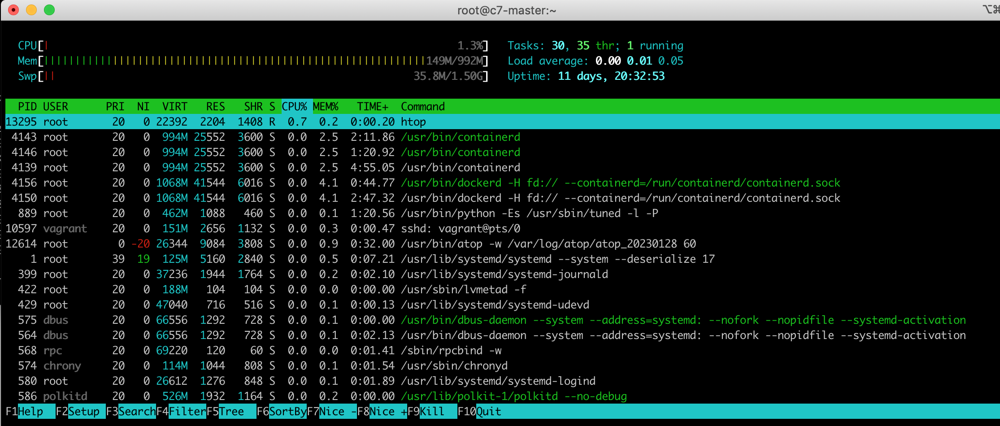

## htop-intro

yum install (is very fast - 103 kB from epel)
```
[root@c7-master ~]# yum install -y htop
Failed to set locale, defaulting to C
Loaded plugins: fastestmirror
Determining fastest mirrors
epel/x86_64/metalink                                                                                                                     |  20 kB  00:00:00
 * base: mirror.airenetworks.es
 * epel: mirror.netcologne.de
 * extras: mirror.airenetworks.es
 * updates: mirror.airenetworks.es
base                                                                                                                                     | 3.6 kB  00:00:00
docker-ce-stable                                                                                                                         | 3.5 kB  00:00:00
epel                                                                                                                                     | 4.7 kB  00:00:00
extras                                                                                                                                   | 2.9 kB  00:00:00
hashicorp                                                                                                                                | 1.4 kB  00:00:00
updates                                                                                                                                  | 2.9 kB  00:00:00
(1/4): epel/x86_64/updateinfo                                                                                                            | 1.0 MB  00:00:00
(2/4): hashicorp/7/x86_64/primary                                                                                                        | 140 kB  00:00:00
(3/4): epel/x86_64/primary_db                                                                                                            | 7.0 MB  00:00:00
(4/4): updates/7/x86_64/primary_db                                                                                                       |  19 MB  00:00:00
hashicorp                                                                                                                                             1016/1016
Resolving Dependencies
--> Running transaction check
---> Package htop.x86_64 0:2.2.0-3.el7 will be installed
--> Finished Dependency Resolution

Dependencies Resolved

================================================================================================================================================================
 Package                             Arch                                  Version                                    Repository                           Size
================================================================================================================================================================
Installing:
 htop                                x86_64                                2.2.0-3.el7                                epel                                103 k

Transaction Summary
================================================================================================================================================================
Install  1 Package

Total download size: 103 k
Installed size: 218 k
Downloading packages:
htop-2.2.0-3.el7.x86_64.rpm                                                                                                              | 103 kB  00:00:00
Running transaction check
Running transaction test
Transaction test succeeded
Running transaction
  Installing : htop-2.2.0-3.el7.x86_64                                                                                                                      1/1
  Verifying  : htop-2.2.0-3.el7.x86_64                                                                                                                      1/1

Installed:
  htop.x86_64 0:2.2.0-3.el7

Complete!
```

There is no background service running / gathering metrics (as htop doesn't collect metrics i.e. it only displays real time activity)
```
[root@c7-master ~]# systemctl status htop.service
Unit htop.service could not be found.
[root@c7-master ~]# systemctl status htop
Unit htop.service could not be found.
```

and just running
```
[root@c7-master ~]# htop
```
and the output is formatted very nicely



i.e. compare with the slightly-bare / sparse regular top

```
[root@c7-master ~]# top
top - 19:32:24 up 11 days, 20:33,  1 user,  load average: 0.00, 0.01, 0.05
Tasks:  95 total,   1 running,  94 sleeping,   0 stopped,   0 zombie
%Cpu(s):  0.3 us,  0.0 sy,  0.0 ni, 99.7 id,  0.0 wa,  0.0 hi,  0.0 si,  0.0 st
KiB Mem :  1015508 total,   150276 free,   112704 used,   752528 buff/cache
KiB Swap:  1572860 total,  1536244 free,    36616 used.   711724 avail Mem

  PID USER      PR  NI    VIRT    RES    SHR S %CPU %MEM     TIME+ COMMAND
    1 root      39  19  128036   5160   2840 S  0.0  0.5   0:07.22 systemd
    2 root      20   0       0      0      0 S  0.0  0.0   0:00.02 kthreadd
    3 root      20   0       0      0      0 S  0.0  0.0   0:04.52 ksoftirqd/0
    5 root       0 -20       0      0      0 S  0.0  0.0   0:00.00 kworker/0:0H
    7 root      rt   0       0      0      0 S  0.0  0.0   0:00.00 migration/0
    8 root      20   0       0      0      0 S  0.0  0.0   0:00.00 rcu_bh
    9 root      20   0       0      0      0 S  0.0  0.0   0:01.80 rcu_sched
   10 root       0 -20       0      0      0 S  0.0  0.0   0:00.00 lru-add-drain
   11 root      rt   0       0      0      0 S  0.0  0.0   0:05.77 watchdog/0
   13 root      20   0       0      0      0 S  0.0  0.0   0:00.00 kdevtmpfs
   14 root       0 -20       0      0      0 S  0.0  0.0   0:00.00 netns
   15 root      20   0       0      0      0 S  0.0  0.0   0:00.21 khungtaskd
   16 root       0 -20       0      0      0 S  0.0  0.0   0:00.00 writeback
   17 root       0 -20       0      0      0 S  0.0  0.0   0:00.00 kintegrityd
   18 root       0 -20       0      0      0 S  0.0  0.0   0:00.00 bioset
   ```
