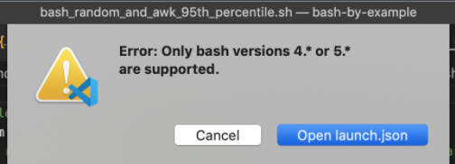
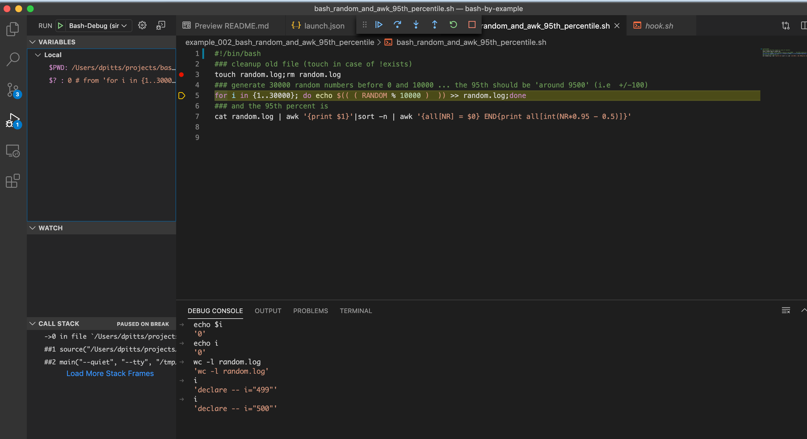

## Setting up vscode-bash-debug - Only bash versions 4.* or 5.* are supported.

### Background 
While working through vscode-bash-debug setup
- https://github.com/rogalmic/vscode-bash-debug
- https://code.visualstudio.com/docs/editor/debugging

I hit "Only bash versions 4.* or 5.* are supported" issues 
- https://github.com/rogalmic/vscode-bash-debug/issues/116 
- https://itnext.io/upgrading-bash-on-macos-7138bd1066ba


After completing the initial setup and setting a breakpoint in my simple bash script

### The problem - bash 3.2 (default macosx version) not supported

I hit a runtime error/issue: "Only bash versions 4.* or 5.* are supported."




Checking my bash version, yes I'm on the older 3.*

```
~/projects/bash-by-example $ bash --version
GNU bash, version 3.2.57(1)-release (x86_64-apple-darwin18)
Copyright (C) 2007 Free Software Foundation, Inc.
```

and I'm not the only one hitting this issue
```
LucianLiu6 commented on 17 Jul 2019
The design that only support 4.* and 5.* makes it not works on Mac
My Mac os version is macOS Mojave 10.14.2 which is almost the latest version of macOS .
But the bash version is 3.2.57(1)-release .
...
@migsc
migsc commented on 2 Aug 2019
I decided to upgrade bash to work around this. This article helped me:
https://itnext.io/upgrading-bash-on-macos-7138bd1066ba
Running macOS Mojave 10.14.5 here.
https://github.com/rogalmic/vscode-bash-debug/issues/116 
```
### Solution brew to the rescue
Fortunately, as I'm macosx, similar to python 2.x vs 3.x, it is relatively easy to setup multiple concurrent versions of bash:
```
brew install bash
https://itnext.io/upgrading-bash-on-macos-7138bd1066ba 
```

The above brew command tooks about 30 seconds to run, the output was quite verbose 


```
~/projects/bash-by-example $ bash --version
GNU bash, version 3.2.57(1)-release (x86_64-apple-darwin18)
Copyright (C) 2007 Free Software Foundation, Inc.
~/projects/bash-by-example $ brew install bash
Updating Homebrew...

==> Auto-updated Homebrew!
Updated 2 taps (homebrew/core and homebrew/cask).
==> New Formulae
autodiff       chezmoi        duktape        fcct           gmailctl       jc             libcpuid       openfast       redo           vlmcsd
bootloadhid    claws-mail     earthly        gdbgui         guile@2        jolie          odin           quill          tanka          volta
cbmc           detach         fargatecli     git-bug        hcxtools       kumactl        oha            rcm            trimage
==> Updated Formulae
awscli ✔                      dhall-lsp-server              imgproxy                      ngt                           singular
icu4c ✔                       dhall-yaml                    inform6                       nickle                        sispmctl
oniguruma ✔                   diamond                       inspircd                      nicovideo-dl                  skaffold
openssl@1.1 ✔                 diff-pdf                      instead                       nift                          snakemake
postgresql ✔                  diff-so-fancy                 inxi                          nlopt                         snapcraft
abcl                          diffoscope                    ipfs                          node                          softhsm
abcmidi                       dita-ot                       ipython                       node-build                    solarus
abseil                        django-completion             ircd-hybrid                   node-sass                     solr
ace                           dmd                           ispc                          node@10                       sonarqube
acpica                        dnsdist                       istioctl                      node@12                      

...

==> Downloading https://homebrew.bintray.com/bottles/bash-5.0.17.mojave.bottle.tar.gz
==> Downloading from https://akamai.bintray.com/0a/0a002b85e82af9ada464528e5e34180897cde3f26f77b04944cc45d4f6bff9d8?__gda__=exp=1588675509~hmac=b109a90
######################################################################## 100.0%
==> Pouring bash-5.0.17.mojave.bottle.tar.gz
🍺  /usr/local/Cellar/bash/5.0.17: 150 files, 9.4MB
==> `brew cleanup` has not been run in 30 days, running now...
Removing: /Users/dpitts/Library/Caches/Homebrew/awscli--2.0.0_1.mojave.bottle.tar.gz... (19.8MB)
Removing: /Users/dpitts/Library/Caches/Homebrew/icu4c--64.2.mojave.bottle.tar.gz... (26.1MB)
Removing: /Users/dpitts/Library/Caches/Homebrew/krb5--1.18.mojave.bottle.tar.gz... (1.3MB)
Removing: /Users/dpitts/Library/Caches/Homebrew/oniguruma--6.9.4.mojave.bottle.tar.gz... (429.3KB)
Removing: /Users/dpitts/Library/Caches/Homebrew/openssl@1.1--1.1.1d.mojave.bottle.tar.gz... (5.2MB)
Removing: /Users/dpitts/Library/Caches/Homebrew/pgbadger--11.1.mojave.bottle.tar.gz... (406.9KB)
Removing: /Users/dpitts/Library/Caches/Homebrew/xz--5.2.4.mojave.bottle.tar.gz... (373.5KB)
Removing: /Users/dpitts/Library/Caches/Homebrew/Cask/virtualbox--6.1.4,136177.dmg... (123MB)
Removing: /Users/dpitts/Library/Caches/Homebrew/Cask/anaconda--2019.10.sh... (424.2MB)
Removing: /Users/dpitts/Library/Caches/Homebrew/Cask/eclipse-jee--4.14.0,2019-12:R.dmg... (349MB)
Removing: /Users/dpitts/Library/Caches/Homebrew/Cask/vagrant--2.2.7.dmg... (29.5MB)
Removing: /Users/dpitts/Library/Caches/Homebrew/Cask/adoptopenjdk--13.0.2,8.tar.gz... (189MB)
Removing: /Users/dpitts/Library/Caches/Homebrew/Cask/visual-studio-code--1.43.0... (82.7MB)
Removing: /Users/dpitts/Library/Logs/Homebrew/postgresql... (1.3KB)
Removing: /Users/dpitts/Library/Logs/Homebrew/gdbm... (64B)
Removing: /Users/dpitts/Library/Logs/Homebrew/python... (3 files, 148.7KB)
Removing: /Users/dpitts/Library/Logs/Homebrew/icu4c... (64B)
Removing: /Users/dpitts/Library/Logs/Homebrew/pgbadger... (64B)
Removing: /Users/dpitts/Library/Logs/Homebrew/readline... (64B)
Removing: /Users/dpitts/Library/Logs/Homebrew/awscli... (64B)
Removing: /Users/dpitts/Library/Logs/Homebrew/sqlite... (64B)
Removing: /Users/dpitts/Library/Logs/Homebrew/xz... (64B)
Removing: /Users/dpitts/Library/Logs/Homebrew/krb5... (64B)
Removing: /Users/dpitts/Library/Logs/Homebrew/oniguruma... (64B)
Removing: /Users/dpitts/Library/Logs/Homebrew/openssl@1.1... (64B)
Removing: /Users/dpitts/Library/Logs/Homebrew/jq... (64B)
Removing: /Users/dpitts/Library/Logs/Homebrew/python@3.8... (3 files, 148.8KB)
Pruned 0 symbolic links and 2 directories from /usr/local
```

and I ran some further checks

```
~/projects/bash-by-example $ bash --version
GNU bash, version 3.2.57(1)-release (x86_64-apple-darwin18)
Copyright (C) 2007 Free Software Foundation, Inc.
~/projects/bash-by-example $ which -a bash
/usr/local/bin/bash
/bin/bash
~/projects/bash-by-example $ which bash
/usr/local/bin/bash
~/projects/bash-by-example $ /usr/local/bin/bash --version
GNU bash, version 5.0.17(1)-release (x86_64-apple-darwin18.7.0)
Copyright (C) 2019 Free Software Foundation, Inc.
License GPLv3+: GNU GPL version 3 or later <http://gnu.org/licenses/gpl.html>

This is free software; you are free to change and redistribute it.
There is NO WARRANTY, to the extent permitted by law.
```

but in practise, the only thing I need to do after running `brew install bash` was restarting VSC i.e. start a  *fresh session*.


NB here is a quick demo of the above commands but in a *freshly opened terminal window session*

```
~ $ which -a bash
/usr/local/bin/bash
/bin/bash
~ $ /usr/local/bin/bash --version
GNU bash, version 5.0.17(1)-release (x86_64-apple-darwin18.7.0)
Copyright (C) 2019 Free Software Foundation, Inc.
License GPLv3+: GNU GPL version 3 or later <http://gnu.org/licenses/gpl.html>

This is free software; you are free to change and redistribute it.
There is NO WARRANTY, to the extent permitted by law.
~ $ /bin/bash --version
GNU bash, version 3.2.57(1)-release (x86_64-apple-darwin18)
Copyright (C) 2007 Free Software Foundation, Inc.
```


## Finally screen shots working (after restarting VSC)

screenshot-vsc-bash-debug-setup-issue.png

